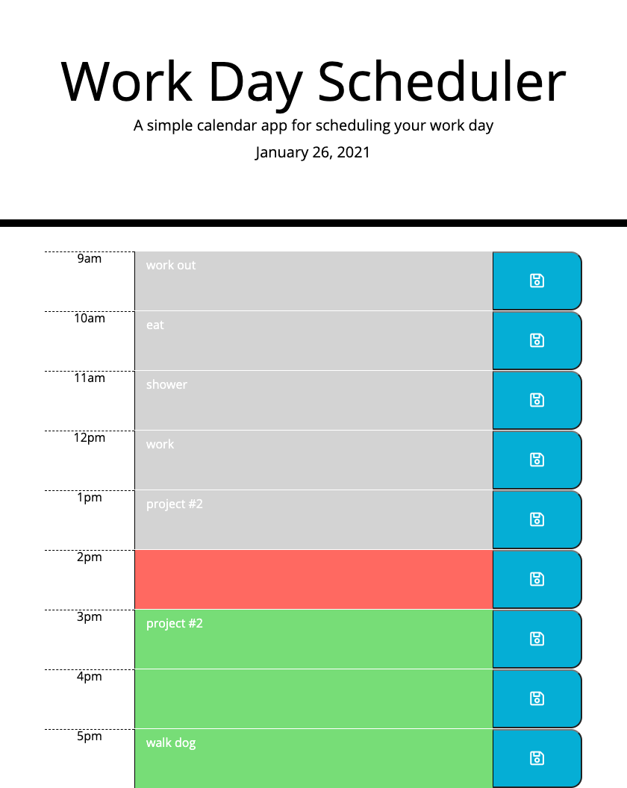

# Daily Planner

## Task

As an employee with a busy schedule, I want to create a daily planner that I can add and save important events to, so I can manage my time more effectively.

## The Application

I've created an application, using jQuery to dynamically update HTML and CSS and the Luxon library, that allows a user to save events for each hour of the day. The application works as follows:

- When the user opens the planner, the current day is displayed at the top

- There are time blocks for standard business hours (9am-5pm) that are color-coded to indicate whether it is in the past, present, or future.

- The user is able to enter an event in the time blocks.

- When the user clicks the save button for a time block, the text for that event is saved in local storage.

- When user refreshes the page, the saved events persist.

## Below is a link to the finished application along with a screenshot of the page

### [Daily planer](https://zocartes.github.io/day-planner-homework/)

### Daily Planner Webpage

